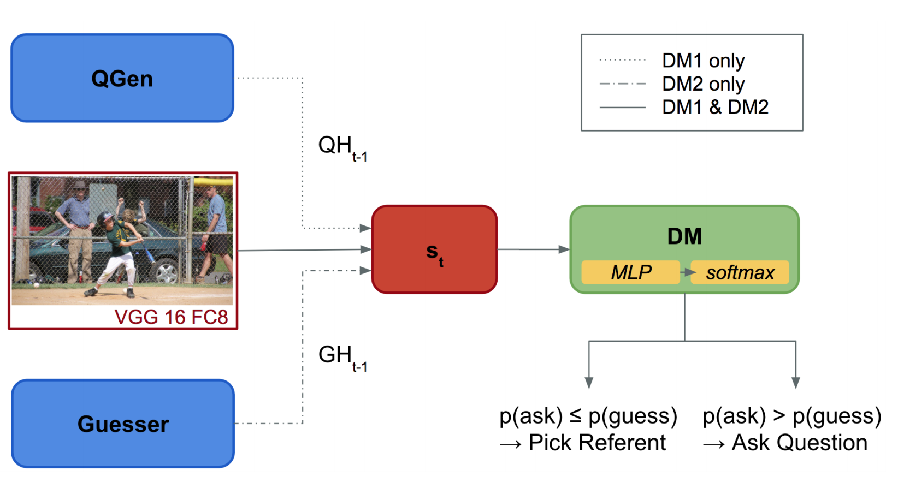

# Ask-No-More

This is the code base for _Ask No More: Deciding when to guess in referential visual dialogue_ https://arxiv.org/abs/1805.06960, accepted at COLING 2018.

Also check our folloe-up [NAACL work](https://github.com/shekharRavi/Beyond-Task-Success-NAACL2019) 



## Getting Started
For each model Question Generator, Guesser, Oracle, DM1 and DM2, a separate training script is in
place and can be found at `train<model>.py`.  

If the training is executed for the first time, the
[GuessWhat?! Dataset](https://guesswhat.ai/download) is expected to be found in the directory
specified in the command line arguments (default is `/data`). If the data is not found, it will be
downloaded.

The training files for Question Generator, DM1, DM2, and the inference script, contain code for computing the VGG
fully-connected features on the fly. However, to accelerate training and inference, the visual features have been
cached using `cache_visual_features.py`.

## Citation
```
@article{shekhar2018ask,
  title={Ask No More: Deciding when to guess in referential visual dialogue},
  author={Shekhar, Ravi and Baumgartner, Tim and Venkatesh, Aashish and Bruni, Elia and Bernardi, Raffaella and Fernandez, Raquel},
  journal={arXiv preprint arXiv:1805.06960},
  year={2018}
}
```

## Contributors
* [Tim Baumgärtner](https://timbmg.github.io/) (The main author of this version of the code)
* [Aashish Venkatesh](https://github.com/AashishV/)
* [Ravi Shekhar](http://shekharravi.github.io)
